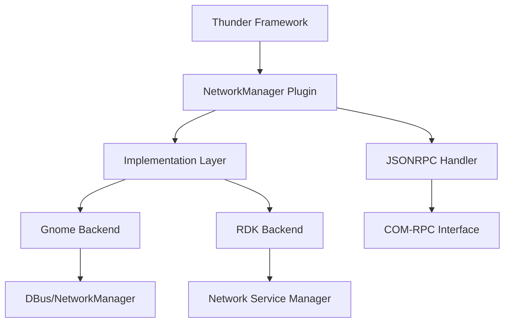
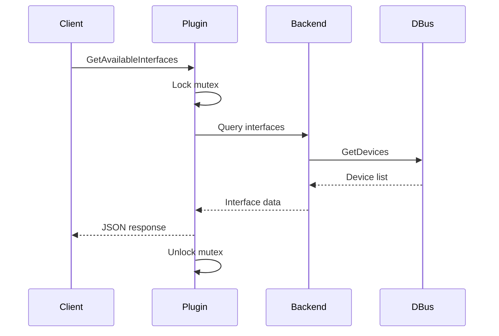
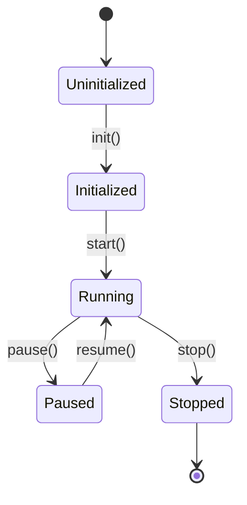
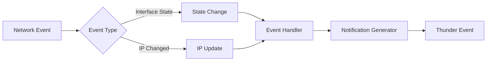
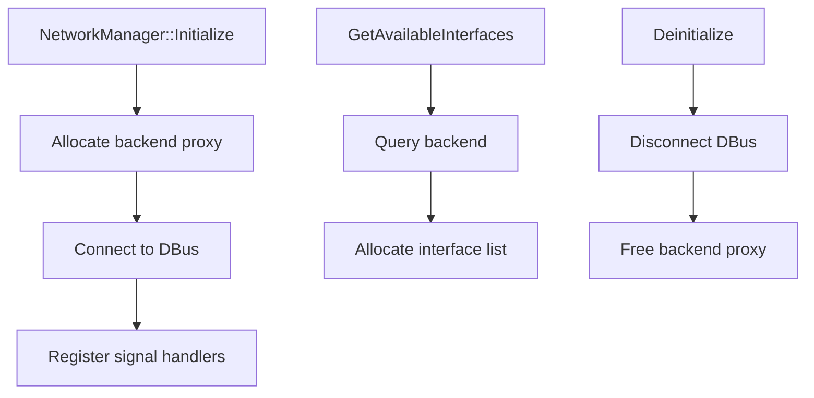

# Technical Documentation Writer for Embedded Systems

## Purpose

Create clear, comprehensive, and maintainable technical documentation for embedded C/C++ projects, with focus on architecture, APIs, threading models, memory management, and platform integration. Specifically tailored for the NetworkManager Thunder plugin project.

## Usage

Invoke this skill when:
- Documenting NetworkManager features (WiFi, Ethernet, connectivity)
- Creating system architecture documentation
- Writing Thunder plugin API reference documentation
- Documenting threading and synchronization models (DBus, JSONRPC)
- Creating developer onboarding guides
- Documenting debugging procedures (network issues, STUN, connectivity)
- Writing integration guides for platform vendors (Gnome NM, RDK NSM backends)

## Documentation Structure

### Directory Layout

```
project/
├── README.md                          # Project overview, quick start
├── docs/                              # General documentation
│   ├── README.md                      # Documentation index
│   ├── architecture/                  # System architecture
│   │   ├── overview.md               # High-level architecture
│   │   ├── component-diagram.md      # Component relationships
│   │   ├── threading-model.md        # Threading architecture
│   │   └── data-flow.md              # Data flow diagrams
│   ├── api/                          # API documentation
│   │   ├── public-api.md            # Public API reference
│   │   └── internal-api.md          # Internal API reference
│   ├── integration/                  # Integration guides
│   │   ├── build-setup.md           # Build environment setup
│   │   ├── platform-porting.md      # Porting to new platforms
│   │   └── testing.md               # Test procedures
│   └── troubleshooting/             # Debug guides
│       ├── memory-issues.md         # Memory debugging
│       ├── threading-issues.md      # Thread debugging
│       └── common-errors.md         # Common error solutions
└── plugin/                           # Source code
    └── docs/                         # Component-specific docs
        ├── connectivity/             # Mirrors source structure
        │   ├── README.md            # Component overview
        │   └── connectivity-test.md
        ├── gnome/
        │   ├── README.md
        │   └── dbus-architecture.md
        └── wifi/
            ├── README.md
            └── scanning-algorithm.md
```

### Document Types

#### 1. **Architecture Documentation** (`docs/architecture/`)
- System overview and design principles
- Component relationships and dependencies
- Threading and concurrency models
- Data flow and state machines
- Memory management strategies
- Platform abstraction layers

#### 2. **API Documentation** (`docs/api/`)
- Public API reference with examples
- Internal API documentation
- Function contracts and preconditions
- Thread-safety guarantees
- Memory ownership semantics
- Error handling conventions

#### 3. **Component Documentation** (`source/docs/`)
- Per-component technical details
- Algorithm explanations
- Implementation notes
- Performance characteristics
- Resource usage (memory, CPU, threads)
- Dependencies and interfaces

#### 4. **Integration Guides** (`docs/integration/`)
- Build system setup
- Platform porting guides
- Configuration options
- Testing procedures
- Deployment checklists

#### 5. **Troubleshooting Guides** (`docs/troubleshooting/`)
- Common error scenarios
- Debug techniques
- Log analysis
- Memory profiling
- Thread race detection

## Documentation Process

### Step 1: Analyze the Code

Before writing documentation:

1. **Read the source code** - Understand implementation
2. **Identify key abstractions** - Classes, structs, modules
3. **Map dependencies** - What calls what, data flow
4. **Find synchronization** - Mutexes, conditions, atomics
5. **Trace resource lifecycle** - Allocations, ownership, cleanup
6. **Review existing docs** - Check for patterns and style

### Step 2: Create Structure

For each component:

```markdown
# Component Name

## Overview
Brief 2-3 sentence description of purpose and role.

## Architecture
High-level design with diagrams.

## Key Components
List main structures, functions, modules.

## Threading Model
How threads interact, synchronization primitives.

## Memory Management
Allocation patterns, ownership, lifecycle.

## API Reference
Public functions with signatures and examples.

## Usage Examples
Common use cases with code snippets.

## Error Handling
Error codes, failure modes, recovery.

## Performance Considerations
Resource usage, bottlenecks, optimization tips.

## Platform Notes
Platform-specific behavior or requirements.

## Testing
How to test, test coverage, known issues.

## See Also
Cross-references to related documentation.
```

### Step 3: Add Diagrams

Use Mermaid for visual documentation:

#### Component Diagram


#### Sequence Diagram


#### State Diagram


#### Data Flow Diagram


### Step 4: Add Code Examples

Provide clear, compilable examples:

#### Good Example Structure
```markdown
### Example: Getting Available Interfaces

This example shows how to query available network interfaces.

**Prerequisites:**
- NetworkManager plugin initialized
- Valid Thunder connection

**Code:**
```c
#include "INetworkManager.h"
#include <stdio.h>

int main(void) {
    INetworkManager* manager = NULL;
    InterfaceList interfaces = {};
    int ret = 0;
    
    // Get NetworkManager instance
    ret = GetNetworkManager(&manager);
    if (ret != 0) {
        fprintf(stderr, "Failed to get NetworkManager: %d\n", ret);
        return -1;
    }
    
    // Get available interfaces
    ret = manager->GetAvailableInterfaces(&interfaces);
    if (ret != 0) {
        fprintf(stderr, "Failed to get interfaces: %d\n", ret);
        ReleaseNetworkManager(manager);
        return -1;
    }
    
    // Process interfaces
    for (size_t i = 0; i < interfaces.count; i++) {
        printf("Interface: %s, Type: %s, Enabled: %d\n",
               interfaces.list[i].name,
               interfaces.list[i].type,
               interfaces.list[i].enabled);
    }
    
    // Cleanup
    FreeInterfaceList(&interfaces);
    ReleaseNetworkManager(manager);
    return 0;
}
```

**Expected Output:**
```
Interface: eth0, Type: ETHERNET, Enabled: 1
Interface: wlan0, Type: WIFI, Enabled: 1
```

**Notes:**
- Always check return values
- Call cleanup functions even on error paths
- Interface names are platform-dependent
```
\`\`\`

### Step 5: Document APIs

For each public function:

```markdown
### GetAvailableInterfaces()

Retrieves the list of available network interfaces on the device.

**Signature:**
```c
Core::hresult GetAvailableInterfaces(
    INetworkManager::IInterfaceDetailsIterator*& interfaces) const;
```

**Parameters:**
- `interfaces` - Output iterator for interface details (must be non-NULL)

**Returns:**
- `Core::ERROR_NONE` - Success
- `Core::ERROR_GENERAL` - Failed to query backend
- `Core::ERROR_UNAVAILABLE` - Backend not initialized

**Thread Safety:**
Thread-safe. Uses internal mutex for backend access.

**Memory:**
Allocates iterator object. Caller must call Release() on iterator.

**Example:**
See [Example: Getting Available Interfaces](#example-getting-available-interfaces)

**See Also:**
- GetPrimaryInterface()
- SetInterfaceState()
- GetInterfaceState()
```

### Step 6: Document Threading

For multi-threaded components:

```markdown
## Threading Model

### Thread Overview

| Thread Name | Purpose | Priority | Stack Size |
|------------|---------|----------|------------|
| Thunder Main | Plugin lifecycle, JSONRPC dispatch | Normal | Default |
| DBus Event | Backend event processing | High | 64KB |
| Connectivity | Internet connectivity tests | Low | 64KB |
| STUN Client | Public IP discovery | Low | 32KB |

### Synchronization Primitives

```c
// Global mutexes
static std::mutex interface_mutex;  // Interface state management
static std::mutex backend_mutex;    // Backend access serialization

// Condition variables
static std::condition_variable connectivity_cv;  // Connectivity test sync
static std::condition_variable stun_cv;          // STUN completion
```

### Lock Ordering

To prevent deadlocks, always acquire locks in this order:

1. `backend_mutex` (backend operations)
2. `interface_mutex` (interface list)
3. Individual interface state locks

**Example:**
```cpp
// CORRECT: Proper lock ordering
std::lock_guard<std::mutex> backend_lock(backend_mutex);
auto interface = GetInterface(name);
std::lock_guard<std::mutex> if_lock(interface->mutex);
// ... use both resources ...

// WRONG: Deadlock risk!
std::lock_guard<std::mutex> if_lock(interface->mutex);
std::lock_guard<std::mutex> backend_lock(backend_mutex);  // May deadlock!
```

### Thread Safety Guarantees

| Function | Thread Safety | Notes |
|----------|---------------|-------|
| GetAvailableInterfaces() | Thread-safe | Uses backend_mutex |
| SetInterfaceState() | Thread-safe | Uses backend_mutex |
| WiFiConnect() | Thread-safe | Async operation |
| IsConnectedToInternet() | Thread-safe | Uses connectivity_cv |
```

### Step 7: Document Memory Management

```markdown
## Memory Management

### Allocation Patterns



### Ownership Rules

1. **Interface objects**: Managed by NetworkManager implementation
2. **JSON strings**: Caller owns returned strings; must free
3. **DBus proxies**: Owned by backend; lifetime tied to plugin

### Lifecycle Example

```cpp
// Initialization phase
NetworkManager* nm = new NetworkManager();
nm->Initialize(service);  // Connects to backend

// Operation phase
string result;
nm->GetAvailableInterfaces(result);  // Returns JSON string
// Use result...

// WiFi operation
nm->StartWiFiScan();  // Async operation
// Notifications will arrive via events

// Cleanup phase
nm->Deinitialize();  // Disconnects backend
delete nm;
```

### Memory Budget

Typical memory usage per component:

| Component | Static | Dynamic (per item) | Notes |
|-----------|--------|-------------------|-------|
| Plugin Instance | 2KB | - | Single instance |
| Backend Proxy | 512 bytes | +128 bytes/interface | Max ~10 interfaces |
| WiFi Scan Results | 0 | 256 bytes/AP | Temporary, freed after delivery |
| Event Handlers | 1KB | - | Signal subscriptions |

**Total typical footprint**: ~5-10KB (plugin + backend + interfaces)
```

## Best Practices

### Writing Style

1. **Be Concise**: Get to the point quickly
2. **Be Specific**: Use exact terms, not vague descriptions
3. **Be Accurate**: Test all code examples
4. **Be Complete**: Don't leave critical details unstated
5. **Be Consistent**: Follow established patterns

### Code Examples

- **Always compile-test** examples before documenting
- **Show error handling** - embedded systems need robust code
- **Include cleanup** - demonstrate proper resource management
- **Add context** - explain when/why to use the code
- **Keep focused** - one example, one concept

### Diagrams

- **Use Mermaid** for all diagrams (version control friendly)
- **Keep simple** - max 10-12 nodes per diagram
- **Label clearly** - all arrows and nodes need names
- **Show flow** - make direction obvious
- **Add legends** - explain symbols if needed

### Cross-References

Link related documentation:

```markdown
## See Also

- [Threading Model](../architecture/threading-model.md) - Overall thread architecture
- [Connection Pool API](connection-pool.md) - Pool management functions
- [Error Codes](../api/error-codes.md) - Complete error code reference
- [Build Guide](../integration/build-setup.md) - Compilation instructions
```

### Platform-Specific Notes

Always document platform variations:

```markdown
## Platform Notes

### Linux
- Uses C++11 or later
- Requires libnm (NetworkManager library) or RDK Network Service Manager
- DBus communication for backend
- Thunder framework dependency

### RDK Devices
- Integration with RDK logger (rdk_debug.h)
- IARM bus support for legacy API compatibility
- Backend selection: Gnome NetworkManager or RDK NSM
- Platform-specific WiFi drivers

### Constraints
- **Memory**: Tested with 64MB minimum
- **CPU**: ARMv7 or better
- **Network**: Ethernet and/or WiFi hardware
- **Dependencies**: Thunder, DBus, backend (libnm or NSM)
```

## Output Format

### Component Documentation Template

```markdown
# [Component Name]

## Overview

[2-3 sentence description]

## Architecture

[High-level design explanation]

### Component Diagram
```mermaid
[Component relationship diagram]
```

## Key Components

### [Structure/Type Name]

[Description]

```c
typedef struct {
    // Fields with comments
} structure_t;
```

## Threading Model

[Thread safety and synchronization]

## Memory Management

[Allocation patterns and ownership]

## API Reference

### [function_name()]

[Full API documentation]

## Usage Examples

### Example: [Use Case]

[Complete working example]

## Error Handling

[Error codes and recovery]

## Performance

[Resource usage and bottlenecks]

## Testing

[Test procedures and coverage]

## See Also

[Cross-references]
```

## Quality Checklist

Before considering documentation complete:

- [ ] All public APIs documented with signatures
- [ ] At least one working code example per major function
- [ ] Thread safety explicitly stated
- [ ] Memory ownership clearly documented
- [ ] Error codes and meanings listed
- [ ] Diagrams for complex flows
- [ ] Cross-references to related docs
- [ ] Platform-specific notes included
- [ ] Code examples compile and run
- [ ] Grammar and spelling checked
- [ ] Reviewed by component author

## Maintenance

Documentation is code:

1. **Update with code changes** - docs and code change together
2. **Version documentation** - tag with releases
3. **Review periodically** - ensure accuracy quarterly
4. **Fix broken links** - validate references
5. **Deprecate carefully** - mark old features clearly

### Deprecation Notice Template

```markdown
## DEPRECATED: old_function()

⚠️ **This function is deprecated as of v2.1.0**

**Reason**: Memory leak risk in error paths

**Alternative**: Use new_function() instead

**Migration Example**:
```c
// Old way (deprecated)
old_function(param);

// New way
new_function(param);
```

**Removal**: Scheduled for v3.0.0 (Est. Q2 2026)
```

## Tools Integration

### Generate API Docs from Code

Use Doxygen-style comments in code:

```c
/**
 * @brief Get available network interfaces
 * 
 * Retrieves the list of all network interfaces (Ethernet, WiFi) available
 * on the device along with their current state and configuration.
 * 
 * @param[out] interfaces  Iterator for interface details
 * 
 * @return Core::ERROR_NONE on success, error code on failure
 * @retval Core::ERROR_NONE        Success
 * @retval Core::ERROR_GENERAL     Backend query failed
 * @retval Core::ERROR_UNAVAILABLE Backend not initialized
 * 
 * @note Thread-safe
 * @see GetPrimaryInterface(), SetInterfaceState()
 * 
 * @par Example:
 * @code
 * IInterfaceDetailsIterator* interfaces = nullptr;
 * uint32_t result = networkMgr->GetAvailableInterfaces(interfaces);
 * if (result == Core::ERROR_NONE) {
 *     // Process interfaces...
 *     interfaces->Release();
 * }
 * @endcode
 */
Core::hresult GetAvailableInterfaces(
    IInterfaceDetailsIterator*& interfaces) const;
```

### Diagram Tools

- **Mermaid Live Editor**: https://mermaid.live
- **VS Code Markdown Preview**: Built-in mermaid support
- **Documentation generators**: Can embed mermaid in output

## Troubleshooting Common Documentation Issues

### Issue: Code example doesn't compile

**Solution**: Always test examples in isolation
```bash
# Extract example to test file
cat > test_example.c << 'EOF'
[paste example code]
EOF

# Compile with project flags
gcc -Wall -Wextra -I../include test_example.c -o test_example

# Run to verify
./test_example
```

### Issue: Diagram is too complex

**Solution**: Break into multiple diagrams
- One high-level overview diagram
- Multiple focused detail diagrams
- Link them together in text

### Issue: Outdated documentation

**Solution**: Add CI check
```bash
# Check for TODOs in docs
grep -r "TODO\|FIXME\|XXX" docs/ && exit 1

# Check for broken links
markdown-link-check docs/**/*.md
```

## Examples From This Project

See existing documentation for reference:
- [NetworkManager Plugin API](../../../docs/NetworkManagerPlugin.md) - Complete API reference
- [README](../../../README.md) - Project overview and design
- [Build Instructions](../../../CMakeLists.txt) - Build system integration
