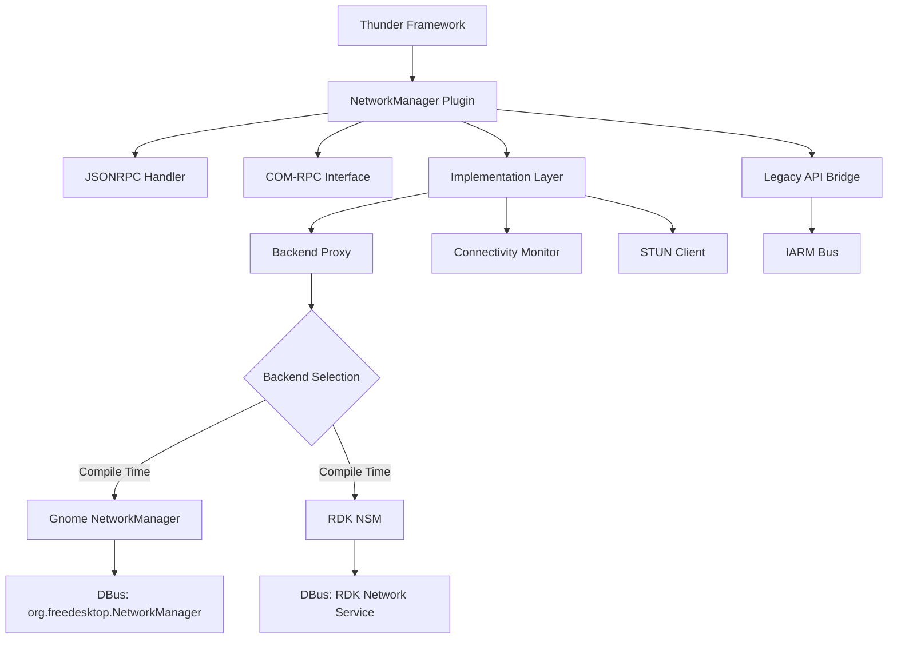
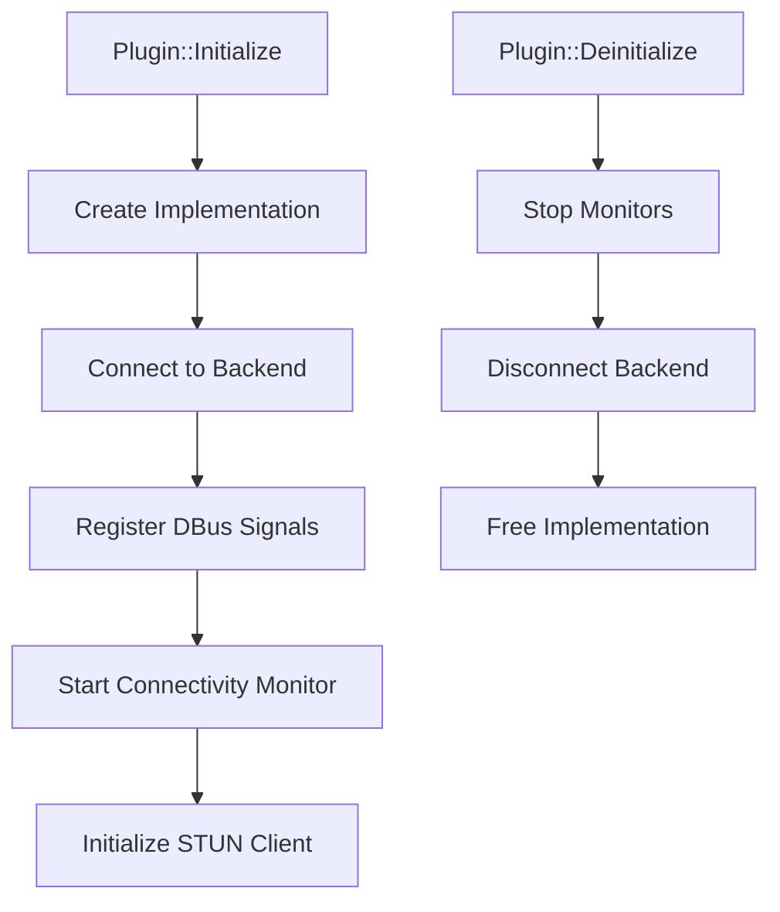

# NetworkManager Thunder Plugin - Project Overview

## Overview

The **NetworkManager Thunder Plugin** (v2.0.0) is a unified, out-of-process Thunder plugin responsible for configuring and managing all networking and WiFi interfaces on RDK devices. It replaces the legacy Network and WiFiManager Thunder plugins, providing a consistent API across multiple backend implementations.

**Key Capabilities:**
- Unified management of Ethernet and WiFi interfaces
- Support for multiple backends (Gnome NetworkManager, RDK Network Service Manager)
- COM-RPC and JSON-RPC API support
- Internet connectivity testing with captive portal detection
- STUN-based public IP discovery
- WiFi scanning, connection management, and signal quality monitoring

## Architecture

### High-Level Design

The plugin operates out-of-process, communicating with backend network services over DBus. This design provides isolation, stability, and flexibility to support multiple platform backends.



### Component Relationships

The plugin architecture consists of several key layers:

1. **Thunder Plugin Layer** (`NetworkManager.cpp`)
   - Plugin lifecycle management (Initialize, Deinitialize)
   - JSONRPC method dispatch
   - Event notification to Thunder clients

2. **Implementation Layer** (`NetworkManagerImplementation.cpp`)
   - Core business logic
   - Connectivity monitoring
   - STUN client integration
   - Platform-independent abstractions

3. **Backend Proxy Layer**
   - **Gnome Backend** (`plugin/gnome/`)
     - DBus communication with NetworkManager daemon
     - Event handling via GLib main loop
     - WiFi scanning and connection management
   - **RDK Backend** (`plugin/rdk/`)
     - DBus communication with RDK Network Service Manager
     - RDK-specific platform integration

4. **Legacy Bridge Layer** (`legacy/`)
   - IARM bus compatibility
   - Legacy Network and WiFiManager API emulation

5. **Support Components**
   - Connectivity testing with configurable endpoints
   - STUN client for public IP discovery
   - Telemetry integration (T2)

## Key Components

### NetworkManager Plugin Class

The main plugin class implementing Thunder's IPlugin interface:

```cpp
class NetworkManager : public PluginHost::IPlugin, 
                      public PluginHost::JSONRPC,
                      public PluginHost::ISubSystem::IInternet
```

**Responsibilities:**
- Plugin activation and deactivation
- JSONRPC method registration
- Event notification management
- COM-RPC interface exposure

### NetworkManagerImplementation Class

Core implementation providing INetworkManager interface:

```cpp
class NetworkManagerImplementation : public Exchange::INetworkManager
```

**Key Methods:**
- `GetAvailableInterfaces()` - Query Ethernet and WiFi interfaces
- `SetInterfaceState()` - Enable/disable interfaces
- `GetIPSettings()` / `SetIPSettings()` - IP configuration management
- `WiFiConnect()` / `WiFiDisconnect()` - WiFi connection control
- `StartWiFiScan()` / `StopWiFiScan()` - WiFi scanning
- `IsConnectedToInternet()` - Internet connectivity verification
- `Ping()` / `Trace()` - Network diagnostics

### Backend Proxies

#### Gnome Backend
Files: `NetworkManagerGnomeProxy.cpp`, `NetworkManagerGnomeWIFI.cpp`, `NetworkManagerGnomeEvents.cpp`

Communicates with Gnome NetworkManager daemon via DBus:
- Interface management using libnm APIs
- WiFi scanning and connection
- Event subscription and propagation

#### RDK Backend
Files: `NetworkManagerRDKProxy.cpp`

Communicates with RDK Network Service Manager:
- Platform-specific network operations
- Integration with RDK ecosystem

### Connectivity Monitor

File: `NetworkManagerConnectivity.cpp`

Monitors internet connectivity by testing configured endpoints:
- Periodic HTTP requests to test endpoints (default: clients3.google.com)
- Captive portal detection
- Limited vs. full internet detection
- Configurable test interval (default: 6 seconds)

```cpp
class ConnectivityMonitor
{
    void startContinuousConnectivityMonitor(int timeoutInSeconds);
    bool isConnectedToInternet(string& ipversion, bool& isLimitedInternet);
    InternetStatus getInternetStatus();
};
```

### STUN Client

File: `NetworkManagerStunClient.cpp`

Discovers device's public IP address using STUN protocol:
- Configurable STUN server endpoint
- Asynchronous public IP retrieval
- Timeout handling

## Threading Model

### Thread Overview

| Thread Name | Purpose | Priority | Stack Size |
|------------|---------|----------|------------|
| Thunder Main | Plugin lifecycle, JSONRPC dispatch | Normal | Default |
| GLib Main Loop | DBus event processing (Gnome backend) | High | 64KB |
| Connectivity Monitor | Internet connectivity tests | Low | 64KB |
| STUN Client | Public IP discovery requests | Low | 32KB |
| WiFi Scan | Asynchronous WiFi scanning | Normal | 64KB |

### Synchronization Primitives

```cpp
// Backend access synchronization
static std::mutex backend_mutex;      // Serializes backend operations
static std::mutex interface_mutex;    // Protects interface list

// Connectivity monitoring
static std::condition_variable connectivity_cv;  // Connectivity test sync
static std::mutex connectivity_mutex;

// STUN operations
static std::mutex stun_mutex;
```

### Lock Ordering

To prevent deadlocks, always acquire locks in this order:

1. `backend_mutex` (backend operations)
2. `interface_mutex` (interface list)
3. Component-specific locks (connectivity, STUN)

### Thread Safety Guarantees

| API Method | Thread Safety | Notes |
|-----------|---------------|-------|
| GetAvailableInterfaces() | Thread-safe | Backend mutex protected |
| SetInterfaceState() | Thread-safe | Backend mutex protected |
| WiFiConnect() | Thread-safe | Async operation with callback |
| IsConnectedToInternet() | Thread-safe | Connectivity mutex protected |
| StartWiFiScan() | Thread-safe | Async scan with event notification |
| GetPublicIP() | Thread-safe | STUN mutex protected |

## Memory Management

### Allocation Patterns



### Ownership Rules

1. **Plugin Instance**: Managed by Thunder framework
2. **Implementation Instance**: Owned by plugin, created at Initialize
3. **Backend Proxies**: Singleton pattern, lifetime tied to plugin
4. **Interface Objects**: Allocated on query, caller must release iterators
5. **Event Strings**: Allocated by implementation, freed after event dispatch
6. **JSON Results**: Caller owns returned strings

### Lifecycle Example

```cpp
// Plugin activation
NetworkManager* plugin = new NetworkManager();
plugin->Initialize(service);  // Creates implementation

// Implementation lifecycle
impl = new NetworkManagerImplementation();
impl->Initialize(config);     // Connects backend, starts monitors

// Operation phase - minimal allocations
impl->GetAvailableInterfaces(iterator);  // Allocates iterator
// ... use iterator ...
iterator->Release();          // Caller releases

// Deactivation
impl->Deinitialize();         // Stops monitors, disconnects backend
delete impl;
plugin->Deinitialize();
delete plugin;
```

### Memory Budget

| Component | Static | Dynamic (per item) | Notes |
|-----------|--------|-------------------|-------|
| Plugin Instance | 2KB | - | Single instance |
| Implementation | 4KB | - | Single instance |
| Backend Proxy | 1KB | +256 bytes/interface | Max ~10 interfaces |
| WiFi Scan Results | 0 | 512 bytes/AP | Temporary, freed after delivery |
| Connectivity Monitor | 2KB | +1KB/endpoint | Max 5 endpoints |
| STUN Client | 1KB | +512 bytes/request | Temporary buffer |
| Event Handlers | 512 bytes | - | DBus signal subscriptions |

**Total typical footprint**: ~15-20KB (plugin + backend + monitors)

## API Interface

### COM-RPC Interface

Defined in `INetworkManager.h`, provides type-safe C++ interface:

```cpp
namespace Exchange
{
    struct INetworkManager: virtual public Core::IUnknown
    {
        // Interface management
        virtual uint32_t GetAvailableInterfaces(
            IInterfaceDetailsIterator*& interfaces) const = 0;
        virtual uint32_t GetPrimaryInterface(string& interface) const = 0;
        virtual uint32_t SetInterfaceState(
            const string& interface, const bool enabled) = 0;
        
        // IP configuration
        virtual uint32_t GetIPSettings(
            const string& interface, 
            const string& ipversion,
            IPAddress& result) const = 0;
        virtual uint32_t SetIPSettings(
            const string& interface,
            const IPAddress& address) = 0;
        
        // WiFi operations
        virtual uint32_t StartWiFiScan(const FrequencyType frequency) = 0;
        virtual uint32_t WiFiConnect(const WIFIConnectParam& param) = 0;
        virtual uint32_t WiFiDisconnect() = 0;
        
        // Connectivity
        virtual uint32_t IsConnectedToInternet(
            string& ipversion, 
            InternetStatus& result) = 0;
        
        // Diagnostics
        virtual uint32_t Ping(
            const string& endpoint,
            const uint32_t packets,
            string& result) = 0;
    };
}
```

### JSON-RPC API

Thunder JSONRPC interface for web/JavaScript clients. Full specification in [NetworkManagerPlugin.md](NetworkManagerPlugin.md).

**Example Request:**
```json
{
    "jsonrpc": "2.0",
    "id": 1,
    "method": "NetworkManager.1.GetAvailableInterfaces"
}
```

**Example Response:**
```json
{
    "jsonrpc": "2.0",
    "id": 1,
    "result": {
        "interfaces": [
            {
                "type": "ETHERNET",
                "name": "eth0",
                "mac": "00:11:22:33:44:55",
                "enabled": true,
                "connected": true
            },
            {
                "type": "WIFI",
                "name": "wlan0",
                "mac": "AA:BB:CC:DD:EE:FF",
                "enabled": true,
                "connected": false
            }
        ]
    }
}
```

## Event Notifications

The plugin sends asynchronous event notifications for state changes:

| Event | Trigger | Data |
|-------|---------|------|
| onInterfaceStateChange | Interface enabled/disabled | interface, state |
| onActiveInterfaceChange | Primary interface changed | prevInterface, currInterface |
| onIPAddressChange | IP acquired or lost | interface, ipversion, address, status |
| onInternetStatusChange | Internet connectivity changed | prevStatus, currStatus, interface |
| onAvailableSSIDs | WiFi scan completed | JSON array of SSIDs |
| onWiFiStateChange | WiFi connected/disconnected | state, ssid |
| onWiFiSignalQualityChange | Signal strength changed | ssid, strength, quality |

**Example Event:**
```json
{
    "jsonrpc": "2.0",
    "method": "NetworkManager.1.onIPAddressChange",
    "params": {
        "interface": "eth0",
        "ipversion": "IPv4",
        "ipaddress": "192.168.1.100",
        "status": "ACQUIRED"
    }
}
```

## Backend Support

### Compile-Time Backend Selection

Backend is selected at build time via CMake options:

```cmake
# Gnome NetworkManager backend (default for Linux)
cmake -DUSE_GNOME_NETWORK_MANAGER=ON ..

# RDK Network Service Manager backend
cmake -DUSE_RDK_NSM=ON ..
```

### Gnome Backend Details

**Dependencies:**
- libnm (NetworkManager library) >= 1.20
- GLib 2.0
- DBus system bus

**DBus Service:** `org.freedesktop.NetworkManager`

**Key Features:**
- Full NetworkManager API support
- WiFi WPA/WPA2/WPA3 support
- 802.1x enterprise WiFi
- Advanced IP configuration (static, DHCP, IPv6)

### RDK Backend Details

**Dependencies:**
- RDK Network Service Manager
- RDK IARM bus library
- RDK logger

**DBus Service:** Platform-specific RDK service

**Key Features:**
- RDK platform integration
- Telemetry support
- Legacy IARM compatibility

## Platform Notes

### Linux Desktop/Server
- Uses C++11 or later
- Requires Gnome NetworkManager backend
- DBus system bus required
- Tested on Ubuntu 20.04+, Fedora 35+

### RDK Devices (Set-Top Boxes, Gateways)
- ARMv7 or ARMv8 CPU
- RDK-B or RDK-V platform
- Integration with RDK logger (`rdk_debug.h`)
- IARM bus support for legacy APIs
- Backend: Gnome NetworkManager or RDK NSM
- Platform-specific WiFi drivers

### Resource Constraints
- **Memory**: 64MB minimum, ~20KB plugin footprint
- **CPU**: ARMv7 or better
- **Network**: Ethernet and/or WiFi hardware required
- **Storage**: Minimal (logs only)

## Build System

### Dependencies

**Required:**
- Thunder/WPEFramework SDK
- CMake >= 3.3
- C++11 compiler (GCC 7+, Clang 6+)
- DBus library

**Backend-Specific:**
- Gnome: libnm, GLib 2.0
- RDK: IARM, RDK logger, RDK NSM

**Optional:**
- T2 telemetry library (USE_TELEMETRY)
- GTest/GMock (ENABLE_UNIT_TESTING)

### Build Instructions

```bash
# Clone repository
git clone https://github.com/rdkcentral/networkmanager.git
cd networkmanager

# Create build directory
mkdir build && cd build

# Configure with Gnome backend
cmake -DCMAKE_INSTALL_PREFIX=/usr \
      -DUSE_GNOME_NETWORK_MANAGER=ON \
      -DUSE_TELEMETRY=OFF \
      ..

# Build
make -j$(nproc)

# Install
sudo make install
```

### CMake Options

| Option | Default | Description |
|--------|---------|-------------|
| USE_GNOME_NETWORK_MANAGER | ON | Enable Gnome backend |
| USE_RDK_NSM | OFF | Enable RDK backend |
| ENABLE_LEGACY_PLUGINS | ON | Build legacy IARM plugins |
| USE_RDK_LOGGER | OFF | Use RDK logger instead of stdout |
| USE_TELEMETRY | OFF | Enable T2 telemetry support |
| ENABLE_UNIT_TESTING | OFF | Build unit tests (L1/L2) |

## Testing

### Unit Tests

Located in `tests/` directory:

**L1 Tests** (`tests/l1Test/`)
- Component-level tests
- Connectivity monitor tests
- STUN client tests
- Route discovery tests

**L2 Tests** (`tests/l2Test/`)
- Integration tests with backends
- Mock backend tests
- End-to-end API tests

**Run Tests:**
```bash
# Configure with testing enabled
cmake -DENABLE_UNIT_TESTING=ON ..
make

# Run L1 tests
./tests/l1Test/l1_test_connectivity
./tests/l1Test/l1_test_stunclient

# Run L2 tests
./tests/l2Test/l2_test_networkmanager
```

### Manual Testing

**Test Connectivity:**
```bash
# Using Thunder Console
curl -X POST http://localhost:9998/jsonrpc \
  -H "Content-Type: application/json" \
  -d '{"jsonrpc":"2.0","id":1,"method":"NetworkManager.1.IsConnectedToInternet"}'
```

**Monitor Events:**
```bash
# Subscribe to events using Thunder tools
ThunderClient events NetworkManager
```

## Legacy API Compatibility

The plugin provides backward compatibility with legacy Network and WiFiManager plugins through IARM bridge:

**Legacy Components:**
- `LegacyNetworkAPIs.cpp` - Network plugin compatibility
- `LegacyWiFiManagerAPIs.cpp` - WiFiManager plugin compatibility

**IARM Methods Supported:**
- `IARM_BUS_NETSRVMGR_API_getActiveInterface`
- `IARM_BUS_NETSRVMGR_API_setIPSettings`
- `IARM_BUS_WIFI_MGR_API_getAvailableSSIDs`
- And more...

## Performance Considerations

### Optimization Guidelines

1. **WiFi Scanning**: Limit scan frequency to avoid battery drain on battery-powered devices
2. **Connectivity Monitoring**: Adjust test interval based on use case (6-60 seconds)
3. **Event Throttling**: Avoid excessive event notifications during interface state transitions
4. **DBus Calls**: Batch operations when possible to reduce IPC overhead

### Resource Usage

**CPU Usage:**
- Idle: <1% CPU
- WiFi scanning: 2-5% CPU
- Connectivity tests: 1-2% CPU per test

**Memory:**
- Base: 15-20KB
- Peak: 50KB (during WiFi scan with 50+ APs)

**Network:**
- Connectivity tests: ~1KB per endpoint per test
- STUN requests: ~100 bytes per request

## Troubleshooting

### Common Issues

**1. Plugin fails to activate**
- **Symptom**: Plugin state remains "Deactivated"
- **Cause**: Backend not available or DBus connection failed
- **Solution**: Check backend service status (`systemctl status NetworkManager`)

**2. WiFi scan returns no results**
- **Symptom**: `onAvailableSSIDs` event contains empty array
- **Cause**: WiFi interface disabled or hardware issue
- **Solution**: Enable interface using `SetInterfaceState`, check `rfkill list`

**3. Internet status always NO_INTERNET**
- **Symptom**: `IsConnectedToInternet` returns NO_INTERNET despite connection
- **Cause**: Connectivity test endpoints unreachable
- **Solution**: Configure alternative endpoints with `SetConnectivityTestEndpoints`

**4. Memory leak over time**
- **Symptom**: Plugin memory usage increases continuously
- **Cause**: Event notifications not released, iterator not freed
- **Solution**: Always call `Release()` on iterators, check event handler cleanup

### Debug Logging

Enable debug logging:

```bash
# Set log level via API
curl -X POST http://localhost:9998/jsonrpc \
  -H "Content-Type: application/json" \
  -d '{"jsonrpc":"2.0","id":1,"method":"NetworkManager.1.SetLogLevel","params":{"loglevel":"DEBUG"}}'
```

**Log Levels:**
- FATAL: Critical errors only
- ERROR: Error conditions
- WARNING: Warning conditions  
- INFO: Informational messages (default)
- DEBUG: Debug-level messages
- VERBOSE: Verbose debug messages

**Log Locations:**
- RDK devices: `/opt/logs/wpeframework.log`
- Linux: `/var/log/wpeframework.log` or stdout

### Diagnostic Commands

```bash
# Check plugin status
WPEProcess -status NetworkManager

# Monitor DBus traffic (Gnome backend)
dbus-monitor --system "sender='org.freedesktop.NetworkManager'"

# Check interface status
ip addr show
nmcli device status

# Test connectivity manually
curl -I http://clients3.google.com/generate_204
```

## Development Guide

### Code Structure

```
networkmanager/
├── interface/          # COM-RPC interface definitions
│   └── INetworkManager.h
├── definition/         # JSON-RPC API definition
│   └── NetworkManager.json
├── plugin/            # Plugin implementation
│   ├── NetworkManager.h/cpp           # Plugin class
│   ├── NetworkManagerImplementation.h/cpp  # Core logic
│   ├── NetworkManagerConnectivity.h/cpp    # Connectivity
│   ├── NetworkManagerStunClient.h/cpp      # STUN client
│   ├── gnome/         # Gnome backend
│   └── rdk/           # RDK backend
├── legacy/            # Legacy IARM bridge
├── tests/             # Unit tests
└── tools/             # CLI tools
```

### Adding New Features

1. **Update Interface** (`INetworkManager.h`)
   - Add new method to COM-RPC interface
   - Document parameters and return values

2. **Update Implementation** (`NetworkManagerImplementation.cpp`)
   - Implement new method
   - Add platform-specific code to backend proxies

3. **Update JSON-RPC** (`NetworkManager.json`)
   - Define JSON-RPC method
   - Add parameter validation

4. **Add Tests**
   - Write L1 unit tests
   - Add L2 integration tests

5. **Update Documentation**
   - Update API reference
   - Add usage examples

### Coding Standards

- **Language**: C++11 or later
- **Style**: Follow Thunder coding conventions
- **Naming**: CamelCase for classes, camelCase for methods
- **Error Handling**: Return Core::ERROR_* codes, log errors
- **Thread Safety**: Document thread safety guarantees
- **Memory**: Use RAII, smart pointers where appropriate
- **Comments**: Doxygen-style for public APIs

## Release Process

### Branches

- `develop` - Active development, PR target
- `main` - Stable releases only

### Workflow

1. Feature development on feature branches
2. PR to `develop` with tests
3. CI validation (build, tests, static analysis)
4. Team review on RDK devices
5. Merge to `develop`
6. Periodic promotion to `main` for releases

### Versioning

Semantic versioning: `MAJOR.MINOR.PATCH`
- **MAJOR**: Incompatible API changes
- **MINOR**: Backward-compatible functionality
- **PATCH**: Backward-compatible bug fixes

Current version: **2.0.0**

## Contributors

### Maintainers

- Jacob Gladish (jacob_gladish@cable.comcast.com)
- Karunakaran Amirthalingam (karunakaran_amirthalingam@comcast.com)

### Contributing

Contributions welcome! Please:
1. Sign RDK Contributor License Agreement (CLA)
2. Fork repository
3. Create feature branch
4. Submit PR with tests and documentation
5. See [CONTRIBUTING.md](../CONTRIBUTING.md) for details

## References

### Documentation

- [API Reference](NetworkManagerPlugin.md) - Complete JSON-RPC API
- [Interface Definition](../interface/INetworkManager.h) - COM-RPC interface
- [Build System](../CMakeLists.txt) - Build configuration
- [Legacy Network API](https://github.com/rdkcentral/rdkservices/blob/main/docs/api/NetworkPlugin.md)
- [Legacy WiFi API](https://github.com/rdkcentral/rdkservices/blob/main/docs/api/WifiPlugin.md)

### External Resources

- [Thunder Framework](https://github.com/rdkcentral/Thunder)
- [RDK Central](https://rdkcentral.com/)
- [Gnome NetworkManager](https://networkmanager.dev/)
- [DBus Specification](https://dbus.freedesktop.org/doc/dbus-specification.html)

## License

Copyright 2023 RDK Management

Licensed under the Apache License, Version 2.0. See [LICENSE](../LICENSE) for full text.

---

**Document Version**: 1.0  
**Last Updated**: April 22, 2026  
**Plugin Version**: 2.0.0
