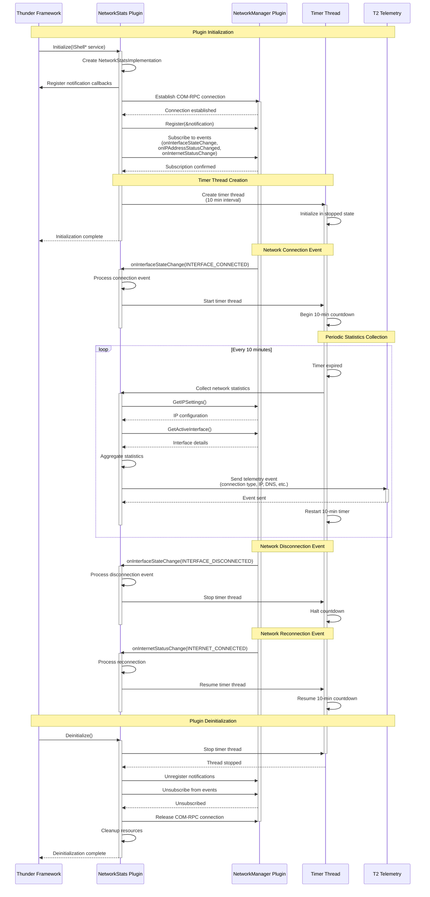
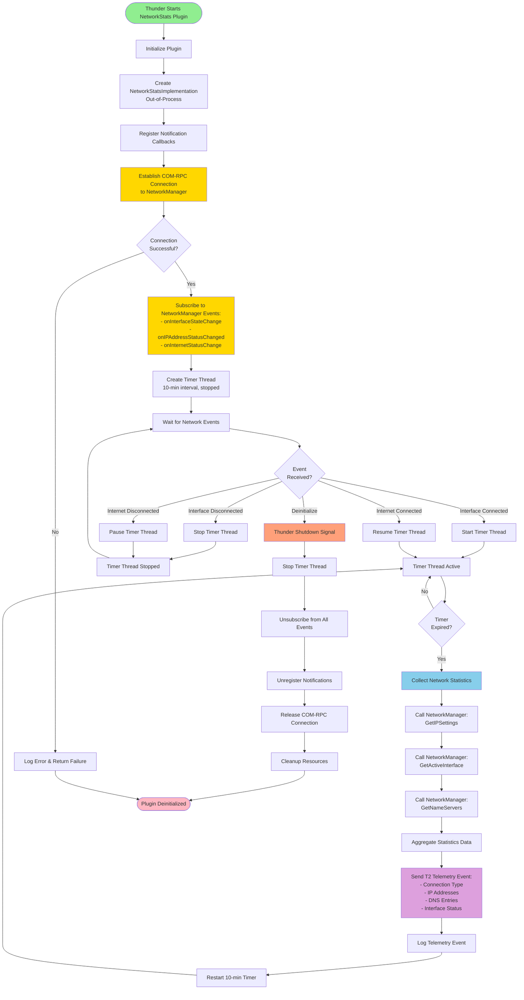

# NetworkStats Module Design Document

## Overview
NetworkStats is a Thunder plugin that runs out-of-process and monitors network connectivity by subscribing to NetworkManager plugin events. It periodically collects network statistics and sends T2 telemetry events.

## Architecture

### Key Components
- **NetworkStats Plugin**: Main Thunder plugin (out-of-process)
- **NetworkManager Interface**: COM-RPC connection to NetworkManager plugin
- **Timer Thread**: Periodic statistics collection (10-minute interval)
- **T2 Telemetry Client**: Sends telemetry events
- **Event Subscription Manager**: Manages NetworkManager event subscriptions

---

## Sequence Diagram



---

## Flowchart



---

## Component Details

### 1. NetworkStats Plugin Structure

```cpp
namespace WPEFramework {
    namespace Plugin {
        class NetworkStats : public PluginHost::IPlugin, public PluginHost::JSONRPC {
            class Notification : public RPC::IRemoteConnection::INotification,
                                 public Exchange::INetworkManager::INotification {
                // Event handlers for NetworkManager events
                void onInterfaceStateChange(const Exchange::INetworkManager::InterfaceState state, 
                                           const string interface) override;
                void onIPAddressStatusChanged(const string& interface, const string& ipAddress, 
                                             const Exchange::INetworkManager::IPStatus status) override;
                void onInternetStatusChange(const Exchange::INetworkManager::InternetStatus prevState,
                                           const Exchange::INetworkManager::InternetStatus currState) override;
                // ... other event handlers
            };
            
        private:
            uint32_t _connectionId;
            PluginHost::IShell* _service;
            Exchange::INetworkManager* _networkManager;
            Core::Sink<Notification> _notification;
            
            // Timer management
            std::thread _statsCollectionThread;
            std::atomic<bool> _timerRunning;
            std::mutex _timerMutex;
            std::condition_variable _timerCondVar;
        };
    }
}
```

### 2. Timer Thread State Machine

```
States:
┌─────────┐    Start Event    ┌─────────┐
│ STOPPED │ ───────────────► │ RUNNING │
└─────────┘                   └─────────┘
     ▲                             │
     │                             │
     │ Stop/Disconnect             │ Pause Event
     │      Event                  │
     │                             ▼
     │                        ┌────────┐
     └────────────────────────│ PAUSED │
              Resume Event    └────────┘
```

### 3. Statistics Collection Flow

**Data Collected Every 10 Minutes:**
- Active network interface (eth0/wlan0)
- Connection type (Ethernet/WiFi)
- IPv4 address and subnet
- IPv6 address (if available)
- DNS server entries (primary/secondary)
- Default gateway
- Interface state (UP/DOWN)
- Internet connectivity status

**T2 Telemetry Event Structure:**
```json
{
    "timestamp": "2025-01-23T10:30:00Z",
    "interface": "eth0",
    "connectionType": "ETHERNET",
    "ipv4Address": "192.168.1.100",
    "ipv6Address": "fe80::1234:5678:90ab:cdef",
    "dnsServers": ["8.8.8.8", "8.8.4.4"],
    "gateway": "192.168.1.1",
    "internetStatus": "CONNECTED",
    "signalQuality": "EXCELLENT"
}
```

---

## Implementation Classes

### NetworkStatsImplementation.cpp
- **Purpose**: Out-of-process implementation
- **Key Methods**:
  - `Configure()`: Parses config, initializes COM-RPC connection
  - `StartStatisticsCollection()`: Starts timer thread
  - `StopStatisticsCollection()`: Stops timer thread
  - `CollectAndSendStatistics()`: Gathers data and sends T2 events
  - `OnNetworkEvent()`: Handles NetworkManager notifications

### NetworkStatsTimer.cpp
- **Purpose**: Manages periodic statistics collection
- **Key Methods**:
  - `Start()`: Begin 10-minute countdown
  - `Stop()`: Halt timer thread
  - `Pause()`: Suspend timer without destroying thread
  - `Resume()`: Continue from paused state
  - `OnTimerExpired()`: Callback for statistics collection

### T2TelemetryClient.cpp
- **Purpose**: Interface with T2 telemetry system
- **Key Methods**:
  - `SendEvent()`: Sends JSON telemetry data
  - `FormatStatistics()`: Converts statistics to T2 format

---

## Configuration

### NetworkStats.config
```json
{
    "locator": "libWPEFrameworkNetworkStats.so",
    "classname": "NetworkStats",
    "callsign": "org.rdk.NetworkStats",
    "autostart": true,
    "configuration": {
        "root": {
            "outofprocess": true,
            "locator": "libWPEFrameworkNetworkStatsImpl.so"
        },
        "collectionInterval": 600,
        "networkManagerCallsign": "org.rdk.NetworkManager",
        "enableT2Telemetry": true,
        "telemetryMarker": "NETWORK_STATS"
    }
}
```

---

## Event Subscription Logic

### Subscribed Events
| Event | Action |
|-------|--------|
| `onInterfaceStateChange(CONNECTED)` | Start timer thread |
| `onInterfaceStateChange(DISCONNECTED)` | Stop timer thread |
| `onInternetStatusChange(CONNECTED)` | Resume timer thread |
| `onInternetStatusChange(DISCONNECTED)` | Pause timer thread |
| `onIPAddressStatusChanged` | Log IP change, continue timer |

---

## Error Handling

1. **COM-RPC Connection Failure**: 
   - Retry connection up to 5 times with exponential backoff
   - Log fatal error if all retries fail
   - Return initialization failure to Thunder

2. **Timer Thread Crash**:
   - Log exception details
   - Attempt to restart timer thread once
   - Notify Thunder of degraded operation

3. **T2 Telemetry Failure**:
   - Log warning (non-fatal)
   - Cache statistics for next successful transmission
   - Continue timer operation

---

## Threading Model

```
Thunder Main Process
│
└─► NetworkStats Plugin (Main Thread)
    │
    ├─► COM-RPC Communication Thread (Thunder managed)
    │
    └─► Out-of-Process Instance
        │
        ├─► Event Notification Thread (Thunder managed)
        │
        └─► Statistics Collection Timer Thread (Custom)
            │
            └─► T2 Telemetry Thread (System)
```

---

## Shutdown Sequence

1. Thunder sends `Deinitialize()` signal
2. NetworkStats sets `_timerRunning = false`
3. Notify timer condition variable to wake thread
4. Join timer thread (wait for completion)
5. Unregister from NetworkManager notifications
6. Call `_networkManager->Unregister(&_notification)`
7. Release COM-RPC interface: `_networkManager->Release()`
8. Cleanup Thunder connection: `_service->Release()`
9. Return control to Thunder

---

## Testing Strategy

### L1 Unit Tests (`tests/l1Test/networkstats_l1_test.cpp`)
- Timer thread start/stop/pause/resume logic
- Statistics data aggregation
- T2 telemetry formatting

### L2 Integration Tests (`tests/l2Test/networkstats_l2_test.cpp`)
- Mock NetworkManager COM-RPC interface
- Simulate network events (connect/disconnect)
- Verify timer behavior with event triggers
- Validate T2 event payload structure

---

## Dependencies

- **Thunder Framework**: COM-RPC infrastructure
- **NetworkManager Plugin**: Network state provider
- **T2 Library**: Telemetry event transmission
- **libnm/GDBus** (indirect): Via NetworkManager backend

---

## Build Integration

### CMakeLists.txt
```cmake
add_library(NetworkStats SHARED
    plugin/networkstats/NetworkStats.cpp
    plugin/networkstats/NetworkStatsImplementation.cpp
    plugin/networkstats/NetworkStatsTimer.cpp
    plugin/networkstats/T2TelemetryClient.cpp
)

target_link_libraries(NetworkStats
    ${NAMESPACE}Plugins::${NAMESPACE}Plugins
    ${NAMESPACE}Definitions::${NAMESPACE}Definitions
    NetworkManagerInterfaces  # For INetworkManager
    t2log                     # T2 Telemetry
)

install(TARGETS NetworkStats DESTINATION lib/${NAMESPACE}/plugins)
install(FILES NetworkStats.config DESTINATION ${CMAKE_INSTALL_PREFIX}/etc/${NAMESPACE}/plugins)
```

---

## Logging

Use `NetworkManagerLogger.h` macros:

```cpp
NMLOG_INFO("NetworkStats timer started (interval: %d sec)", interval);
NMLOG_WARNING("Failed to collect statistics, retry scheduled");
NMLOG_ERROR("COM-RPC connection to NetworkManager lost");
NMLOG_DEBUG("Telemetry event sent: %s", jsonData.c_str());
```

---

## Future Enhancements

1. **Configurable Collection Interval**: Allow runtime adjustment via JSON-RPC
2. **Historical Data Storage**: Cache last N statistics for trend analysis
3. **Bandwidth Monitoring**: Track data usage per interface
4. **Alert Thresholds**: Trigger events on connection quality degradation
5. **Multi-Interface Support**: Collect statistics from all interfaces simultaneously

---

## References

- NetworkManager Plugin Documentation
- [Thunder Plugin Architecture](https://github.com/WebPlatformForEmbedded/Thunder)
- COM-RPC Interface Guide
- [T2 Telemetry Specification](https://github.com/rdkcentral/rdk-telemetry)

---

## Revision History

| Version | Date | Author | Changes |
|---------|------|--------|---------|
| 1.0 | 2025-12-17 | Initial Design | Created sequence diagram and flowchart |
